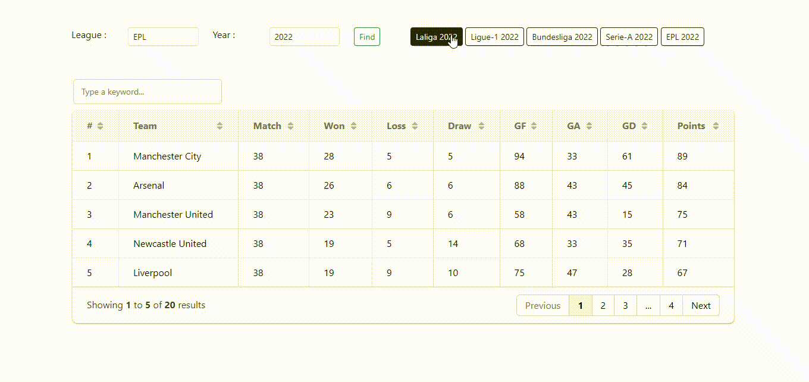

# european_football_league_standings_frontend
This is a frontend of the "European Football League Standings" project.

### A bit about European Football

European football enjoys immense popularity due to various factors. Its historical roots lie in Europe, with countries like England, Italy, Germany, and Spain developing rich football cultures since the 19th century. Europe hosts some of the world's top football leagues featuring <b>high-quality</b> play. Tournaments like the UEFA <b>Champions League</b> and UEFA <b>Europa League</b> also boost their popularity. The global reach of European football is enhanced by <b>wide-spread media coverage</b> and international club tours. The excitement is fueled further by <b>historic club rivalries</b> and strong football culture in many European nations. Lastly, nurturing <b>young talent</b> through club academies helps sustain European football's a high standard and global appeal.

## API sourced:  https://github.com/JitKrNaskar/european_football_league_standings_backend_services

### Framework used:
<b>Bootstrap</b>: Bootstrap is a popular front-end framework used for web development, providing a set of pre-designed components and styles to streamline the process of building responsive websites.

### Libraries used:

<b>Grid.js</b>: Grid.js is a JavaScript library that enhances the user experience of working with tabular data in web applications. It provides features like sorting, filtering, pagination, and editing capabilities. With a simple API, it allows you to create interactive and responsive data grids, customize appearance and behavior, and incorporate advanced features like grouping and data export. Grid.js stands out for its performance optimization, handling large datasets efficiently without compromising speed or responsiveness. Overall, Grid.js is a versatile tool for creating dynamic and interactive data tables in web applications, improving usability and functionality.

## How It Works:

### Scenario-1:

### Scenario-2:

### Scenario-3:

### Scenario-4:

### Scenario-5:

## Summary:

I am grateful to <a href="https://getbootstrap.com/">Bootstrap</a> and <a href="https://gridjs.io/docs">Grid.js</a> for the convenience and efficiency they have brought to my web development projects. These frameworks and libraries have greatly enhanced my workflow and made it easier to create responsive and interactive websites.
 
I would also like to thank Mr.Sankha Subhra Mondal as his <a href="https://github.com/Sankha1998/pre-built-database-MySql">repository</a> and <a href="https://github.com/Sankha1998">profile</a> have been a valuable source of inspiration, offering solutions and insights that shaped my project's success. His meticulous commits and clear codebase made complex concepts easier to understand, enhancing our knowledge. I am grateful for his open-mindedness and generosity in sharing his expertise, which has elevated my project and improved my development skills. His repositories have been guiding lights in the intricate and ever-evolving world of software development, and I deeply appreciate the time and effort you've dedicated to creating and maintaining them.
